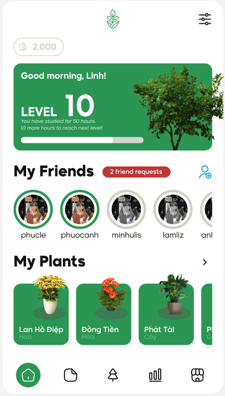
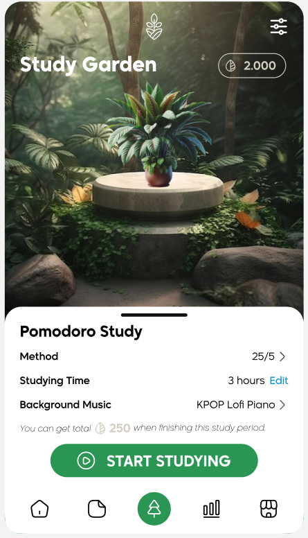
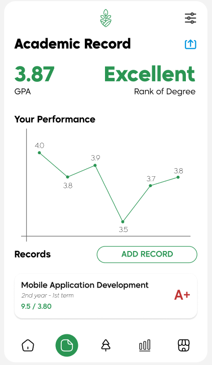

# Pomodoro

Ứng dụng Android cung cấp trải nghiệm học tập với phương pháp đếm giờ Pomodoro.

**✎ File thiết kế Figma**: [Figma Design File](https://www.figma.com/file/Bs56fpxGaV04uRmmRgK0D4/Pomodoro?type=design&node-id=0%3A1&mode=design&t=EWPuyl0fcpmqMvJP-1)

Ứng dụng Pomodoro là ứng dụng Android, cung cấp trải nghiệm học tập với phương pháp đếm giờ Pomodoro mới lạ đến người dùng thông qua việc sưu tầm các loại cây và hoa; kiếm tiền và lên cấp sưu tầm bằng thời gian học tập với Pomodoro.

Ứng dụng là sản phẩm của bài tập lớn học phần Lập trình Java _(thầy Phạm Xuân Lâm - kỳ Xuân 2024)_

## Các chức năng chính

### 1. Vườn học tập (Chức năng chính):

Người dùng có thể tuỳ chỉnh:

- Phương pháp Pomodoro: Gồm 2 phương pháp là 25/5 _(học 25 phút, giải lao 5 phút và lặp lại)_ và 50/10 _(Học 50 phút, giải lao 10 phút và lặp lại)_
- Tổng thời gian học: Lựa chọn tổng thời gian để tập trung học. Dựa trên phương pháp Pomodoro đã chọn bên trên, ứng dụng sẽ tự động phân chia các giai đoạn học tập cho vừa khớp với tổng thời gian này.
- Nhạc nền: Lựa chọn bài nhạc nền để phát trong quá trình học tập.

Khi bấm nút "Bắt đầu học", ứng dụng sẽ tự động sắp xếp xen kẽ giai đoạn học & giai đoạn giải lao dựa trên phương pháp Pomodoro và tổng thời gian học mà người dùng đã tuỳ chỉnh bên trên.

Khi hoàn thành một giai đoạn, người dùng sẽ nhận thưởng bao gồm tiền _(để mua cây mới trong cửa hàng)_ và kinh nghiệm _(để lên cấp sưu tầm)_

### 2. Thống kê thời gian học:

Các dữ liệu về tập trung học của người dùng sẽ được lưu lại và hiển thị dưới dạng các báo cáo, bao gồm:

- Một biểu đồ cột thể hiện thời gian tập trung học trung bình của từng ngày
- Danh sách các thông tin bao gồm:
  - Thời gian học trung bình (tổng tất cả dữ liệu)
  - Số tiền trung bình nhận được
  - Phương pháp học tập yêu thích

### 3. Kết quả học tập:

Người dùng có thể nhập vào kết quả học tập (bao gồm các đầu điểm 10%, 40% và 50% của từng môn học). Sau đó, ứng dụng sẽ tự tính toán GPA trung bình từng kỳ _(Biểu diễn bằng biểu đồ)_, GPA tổng và xếp hạng bằng tốt nghiệp dựa trên GPA tổng.

## Phương pháp lưu trữ dữ liệu

- Cơ sở dữ liệu sử dụng: Firebase. Cụ thể, ứng dụng sử dụng:
  - Firebase Authentication để thực hiện chức năng đăng ký/đăng nhập.
  - Firestore để lưu trữ các dữ liệu đồng bộ trực tuyến.
  - Realtime Database để quản lý trạng thái đếm giờ Pomodoro của người dùng.
- Lưu trữ local: Lưu trong thiết bị người dùng. Gồm các thông tin:
  - Tên tài khoản và mật khẩu _(đã mã hoá)_ để phục vụ việc tự động đăng nhập ở các lần kế tiếp
  - Dữ liệu người dùng bao gồm: Bản ghi kết quả học tập, các thiết lập Pomodoro
  - Dữ liệu thống kê: Các dữ liệu về thời gian học Pomodoro của người dùng

Các dữ liệu lưu trữ local sẽ được tự động load vào ứng dụng và đồng bộ lên cơ sở dữ liệu (nếu cần thiết).

## Ngôn ngữ hỗ trợ

- Tiếng Việt
- Tiếng Anh (United States)
- Tiếng Hàn (한국인)
